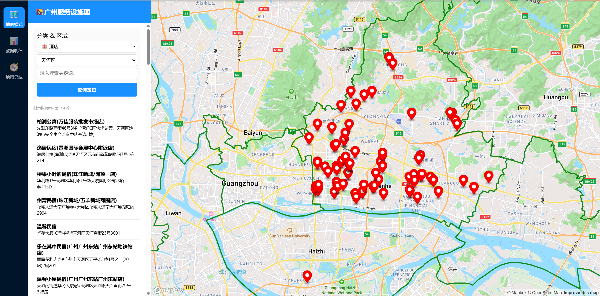
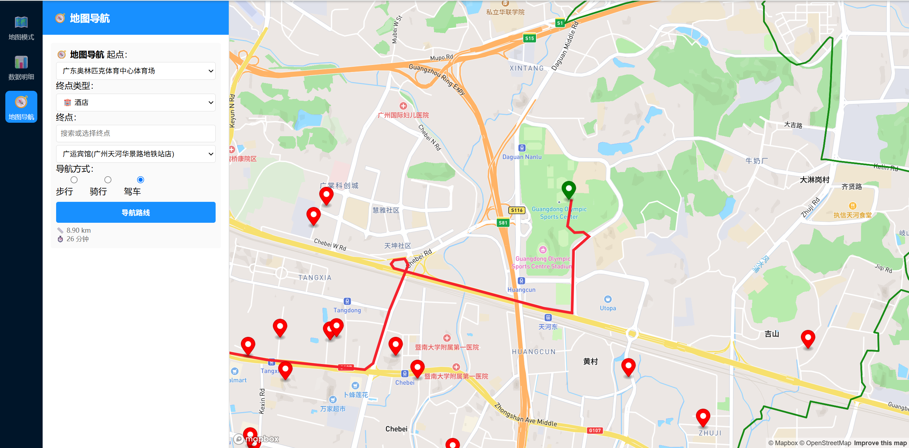

# 广州服务设施综合管理与路径导航 WebGIS 平台

一个基于 **Mapbox GL JS + GeoJSON + Mapbox Directions API** 构建的广州城市服务设施 WebGIS 应用，用于展示、检索和分析酒店、美食、景点、休闲娱乐等 POI，并提供地图选点与步行/骑行/驾车路径规划。

> **项目定位：** GIS 开发 / WebGIS / 地图应用开发作品集项目

## 在线 Demo

GitHub Pages：  
`https://hongdodong060-hash.github.io/czx_gis/`

> 首次部署后，如果地图没有显示，请按项目中的 `config.example.js` 创建 `config.js`，并配置一个受域名限制的 **Mapbox Public Access Token（pk...）**。不要使用 Secret Token（sk...）。

## 项目亮点

- 基于 Mapbox GL JS 构建交互式 WebGIS 地图
- GeoJSON 管理广州酒店、美食、景点、休闲娱乐等 POI 数据
- 支持 POI 分类筛选、行政区筛选与关键词检索
- 支持地图定位、Marker、Popup 与行政区边界可视化
- 支持地图选点 → 坐标获取 → 路线规划的完整交互流程
- 基于 Mapbox Directions API 实现步行、骑行、驾车路线规划
- 展示路线距离与预计耗时
- 前端采用 HTML / CSS / JavaScript 实现页面交互

## 界面预览

### 地图总览


### 设施检索


### 路径导航


## 技术栈

| 类型 | 技术 |
| --- | --- |
| 前端 | HTML5 / CSS3 / JavaScript |
| WebGIS | Mapbox GL JS |
| 空间数据 | GeoJSON |
| 路径规划 | Mapbox Directions API |
| 数据组织 | JSON / GeoJSON |
| 部署 | GitHub Pages |

## 功能模块

### 1. 地图展示
- 广州市区地图
- 行政区边界
- POI Marker
- Popup 属性信息

### 2. 设施检索
- 酒店
- 美食
- 景点周边游
- 休闲娱乐
- 关键词搜索
- 行政区筛选

### 3. 路径导航
- 起点选择
- 终点选择
- 地图选点
- 步行 / 骑行 / 驾车
- 路线绘制
- 距离与预计时间

## 项目结构

```text
czx_gis/
├── index.html
├── app.css
├── config.example.js
├── favicon.png
├── data/
│   ├── 广州市区界线.json
│   ├── 酒店.json
│   ├── 美食.json
│   ├── 景点周边游.json
│   └── 休闲娱乐.json
├── js/
│   └── main.js
└── screenshots/
    ├── overview.png
    ├── poi-search.png
    └── route-planning.png
```

## 本地运行

由于浏览器对本地 `file://` 加载 JSON 有跨域限制，建议使用本地 HTTP Server。

```bash
python -m http.server 8000
```

然后访问：

```text
http://localhost:8000/
```

## Mapbox Token 配置

复制：

```text
config.example.js
```

为：

```text
config.js
```

并填写：

```javascript
window.MAPBOX_ACCESS_TOKEN = '你的 Mapbox Public Token';
```

`config.js` 已被 `.gitignore` 忽略，不应提交到公开仓库。

## 数据说明

GitHub 公开版本仅保留用于演示的精简 POI 样本，并移除了不必要的商户电话、商户 ID 等字段，以便作为公开作品集展示。

## 项目成果

本项目重点体现：

**空间数据组织 → WebGIS 可视化 → POI 查询 → 地图交互 → 路径分析 → 前端部署**

适合作为 GIS 开发、WebGIS 开发、GIS 数据分析岗位的项目作品集。

## 作者

**Hong Do Dong**  
GitHub: `https://github.com/hongdodong060-hash`
